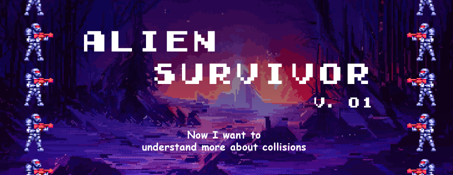

# INSTRUCTIONS | HOW TO PLAY

## Description =>

I've created a simple based `Object-oriented programming` game with a 66% of its code language writed in `Javascript`. It is inspired in the retro classic games like `Mario Bros`, `Donkey Kong` and some visuals inspired in the `Alien Movies` and `Hallo Xbox Games`. 

 

## How to play =>

- In this jumpling platform game you'll need to use the Arrow Keys `LEFT` and `RIGHT` to jump between platforms each platform has its bouncing effect so the only thing you `DON'T` need to do is to fall into the Alien Claws!!!

- `REMEMBER JUST ONE CLICK EACH TIME xD`

- Everytime you catch a platform your score is gonna increase 1 point!

## PLAY HERE =>

https://sergiovede26.github.io/game-proyect-april-2024/

 

